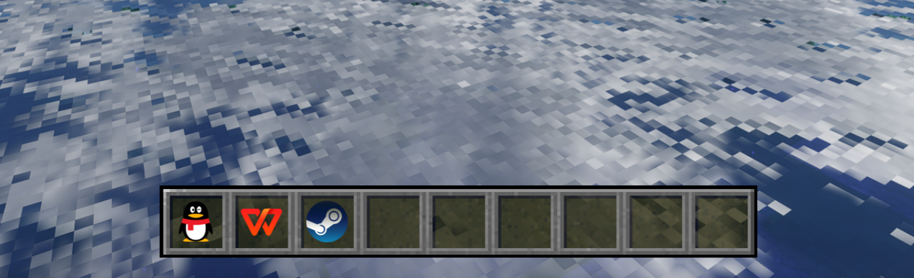

# 我的世界物品栏窗口组件

一款使用 PyQt5 构建的我的世界物品栏窗口组件，适用于linux，仅在Deepin上做过测试

## 预览


## 功能

- 可拖拽Desktop文件到物品栏格子中
- 可右键编辑格子
- 可设置大小缩放和窗口位置固定
- 可设置窗口置于底层，置于顶层或正常窗口

## 运行

1.  安装依赖
```shell
pip install -r requirements.txt
```
2.  运行主程序: 
```shell
python main.py
```
## 打包
## pyinstaller打包
安装pyinstaller
```shell
pip install pyinstaller
```
运行pyinstaller打包
```shell
pyinstaller AFontViewer.spec
```
## 玲珑打包
安装ll-builder
```shell
sudo apt-get install ll-builder
```
根据已配置好的linglong.yaml打包
```shell
ll-builder build
```
注：目前玲珑打包的版本没法启动应用，推荐使用python启动
## 后言
此项目素材由[Mc Assets](https://mcasset.cloud/)提供  
此项目部分代码由llm完成
