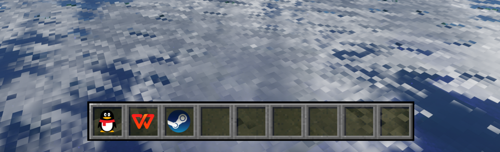

<p align="center">English</a> | <a href="README_CN.md">中文</a></p>

# DesktopHotbar

Minecraft-style desktop hotbar, built with **Qt6/C++**, supports X11 and Wayland.

The original PyQt5 version is kept in `main.py` as a fallback.

## Preview


## Features

- Drag & drop `.desktop` files onto 9 hotbar slots
- Left-click to launch apps (via `gio launch`, matching desktop behavior)
- Right-click context menu (Minecraft book style, book.png background)
  - Launch / Remove from hotbar / Slot settings / General settings
- General settings: lock window position, scale (0.25x ~ 10x)
- Mouse hover highlight
- Persistent config (`~/.config/desktophotbar/config.json`)
- X11 window position memory; on Wayland, position is managed by the compositor

## Dependencies

| Distro | Install |
|--------|---------|
| Arch / CachyOS / Manjaro | `sudo pacman -S qt6-base cmake gcc` |
| Debian / Ubuntu / Deepin | `sudo apt install qt6-base-dev cmake g++` |
| Fedora | `sudo dnf install qt6-qtbase-devel cmake gcc-c++` |

Input method: `fcitx5-qt6` (optional)

## Build & Run

```shell
cmake -B build -DCMAKE_BUILD_TYPE=Release
cmake --build build --parallel $(nproc)
./build/DesktopHotbar
```

## Install

```shell
./install.sh               # build + install to system
./install.sh --uninstall   # uninstall
```

## Python version (fallback)

```shell
pip install -r requirements.txt
python main.py
```

## Assets

Provided by [Mc Assets](https://mcasset.cloud/)
